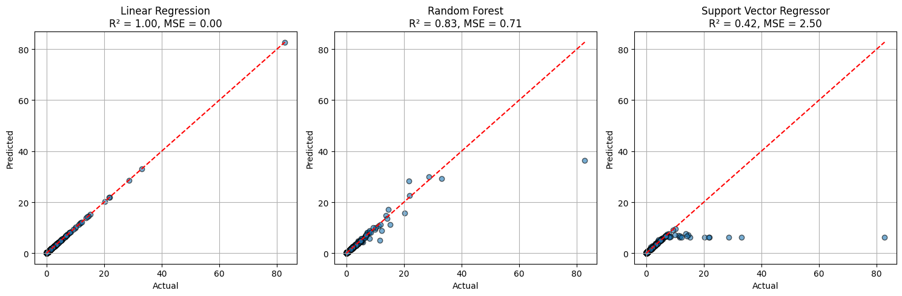

# Laporan Proyek Machine Learning - Athalla Naufal Muthahhari

## Domain Proyek: Prediksi Penjualan Video Game

Dalam industri video game yang sangat kompetitif, mengetahui potensi penjualan suatu game sangat krusial bagi para pengembang dan penerbit untuk merencanakan strategi pemasaran, alokasi sumber daya, dan distribusi. Dataset penjualan video game ini memuat informasi penjualan dari berbagai wilayah seperti NA (North America), EU (Europe), JP (Japan), dan Other, serta berbagai fitur seperti genre, platform, dan publisher. Proyek ini bertujuan untuk memprediksi `Global_Sales` dari sebuah game berdasarkan informasi tersebut menggunakan pendekatan regresi.

## Business Understanding

### Problem Statements
1. Bagaimana cara memprediksi total penjualan global (`Global_Sales`) sebuah game berdasarkan atribut-atribut lainnya?
2. Algoritma machine learning mana yang memberikan hasil paling akurat dalam memprediksi penjualan game?

### Goals
1. Mengembangkan model prediksi `Global_Sales` dari data fitur yang tersedia.
2. Membandingkan performa tiga model regresi untuk menentukan model terbaik.

### Solution Statements
- Membangun tiga model prediktif menggunakan:
  - Linear Regression
  - Random Forest Regressor
  - Support Vector Regressor (SVR)
- Melakukan evaluasi performa model menggunakan metrik **R²** dan **Mean Squared Error (MSE)**.
- Visualisasi performa prediksi setiap model terhadap data aktual untuk pemilihan model terbaik.

## Data Understanding

Dataset yang digunakan diambil dari Kaggle: [Video Game Sales Dataset](https://www.kaggle.com/datasets/zahidmughal2343/video-games-sale)

Dataset ini memiliki fitur-fitur sebagai berikut:
- `Name`: Nama game
- `Platform`: Platform game dirilis
- `Year_of_Release`: Tahun rilis
- `Genre`: Genre game
- `Publisher`: Penerbit
- `NA_Sales`, `EU_Sales`, `JP_Sales`, `Other_Sales`: Penjualan regional (dalam jutaan unit)
- `Global_Sales`: Penjualan total (target prediksi)

Beberapa insight awal:
- `Global_Sales` merupakan penjumlahan langsung dari keempat penjualan wilayah.

## Data Preparation

Tahapan data preparation meliputi:
1. **Pembersihan data**:
   - Menghapus baris dengan nilai `Global_Sales` kosong.
2. **Fokus fitur numerik**:
   - Digunakan: `NA_Sales`, `EU_Sales`, `JP_Sales`, `Other_Sales` untuk membentuk model regresi awal.
3. **Split data**:
   - 80% data untuk training, 20% untuk testing (`train_test_split` dengan `random_state=42`).

Catatan: Meski `Global_Sales` adalah hasil penjumlahan dari keempat fitur penjualan, ini digunakan sebagai baseline model.

## Modeling

### Model 1: Linear Regression
- Pendekatan sederhana namun kuat untuk data yang berhubungan linier.
- Tidak memerlukan parameter khusus.
- Kelebihan: Interpretatif dan cepat.
- Kekurangan: Kurang fleksibel terhadap non-linearitas.

### Model 2: Random Forest Regressor
- Ensemble learning berbasis decision tree.
- Parameter default digunakan.
- Kelebihan: Menangani non-linearitas dan robust terhadap outlier.
- Kekurangan: Bisa overfitting jika tidak dikontrol.

### Model 3: Support Vector Regressor (SVR)
- Kernel-based regression model.
- Digunakan kernel RBF tanpa tuning.
- Kelebihan: Baik untuk data kecil.
- Kekurangan: Kurang akurat tanpa scaling dan tuning.

## Evaluation

### Metrik Evaluasi:
- **R² (coefficient of determination)**: Seberapa baik model menjelaskan varians data.
- **Mean Squared Error (MSE)**: Rata-rata kesalahan kuadrat dari prediksi.

### Hasil Evaluasi:
| Model                   | R² Score | MSE   |
|------------------------|---------|-------|
| Linear Regression      | 1.00    | 0.00  |
| Random Forest Regressor| 0.83    | 0.71  |
| SVR                    | 0.42    | 2.50  |

**Interpretasi**:
- Linear Regression mendapat hasil sempurna karena `Global_Sales` = jumlah 4 fitur input.
- Random Forest juga cukup baik dengan MSE < 1, cocok untuk prediksi non-linear.
- SVR gagal memodelkan data dengan baik tanpa tuning dan preprocessing tambahan.

### Visualisasi:
Disertakan grafik hasil prediksi vs nilai aktual dengan garis merah sebagai referensi ideal. Linear Regression sejajar sempurna, sedangkan Random Forest dan SVR menyimpang tergantung performanya.

## Kesimpulan

- Linear Regression terlalu akurat karena target adalah hasil penjumlahan dari fitur input (problem identitas).
- Model yang lebih realistis untuk masa depan adalah **Random Forest**, terutama jika input data berasal dari metadata lain.
- SVR kurang sesuai untuk data ini tanpa tuning lanjutan.

**Saran Lanjutan**:
- Gunakan fitur seperti `Genre`, `Platform`, dan `Publisher` untuk prediksi regional sales.
- Lakukan one-hot encoding atau label encoding untuk variabel kategorikal.
- Coba hyperparameter tuning pada SVR dan Random Forest.
- Evaluasi tambahan dengan fitur `Year_of_Release` sebagai prediktor.

---

